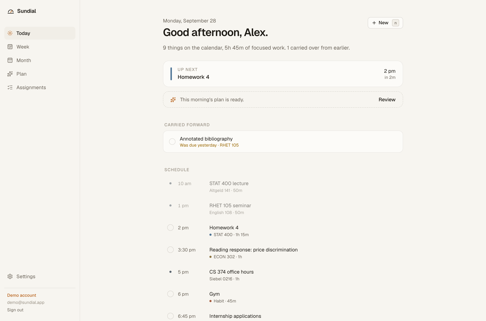
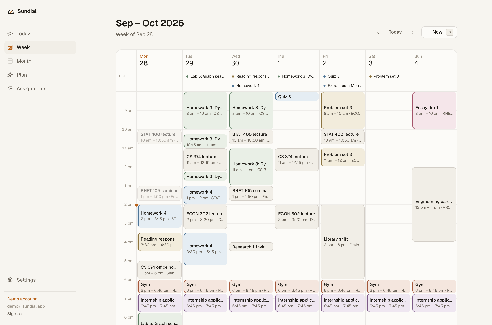
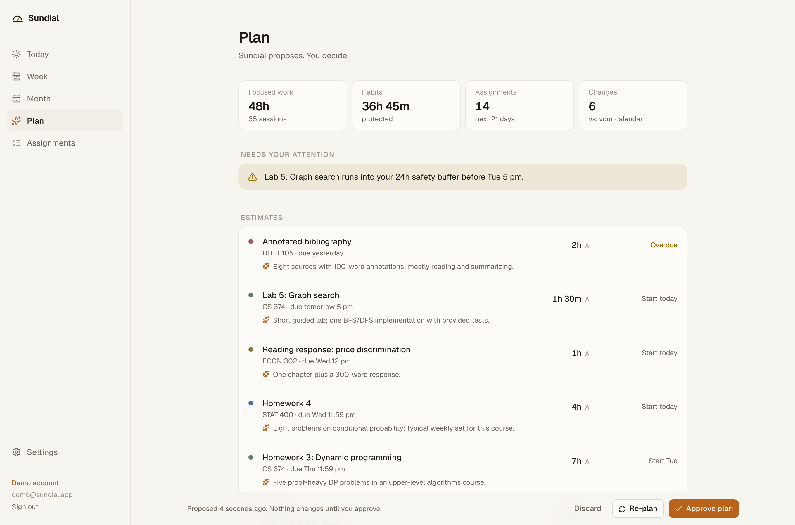
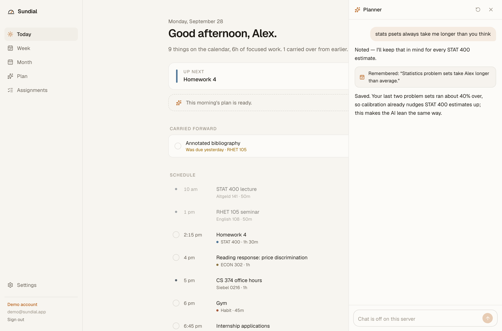
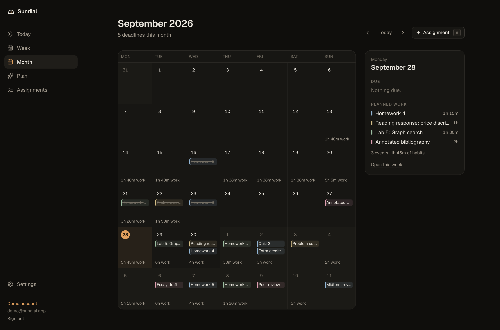
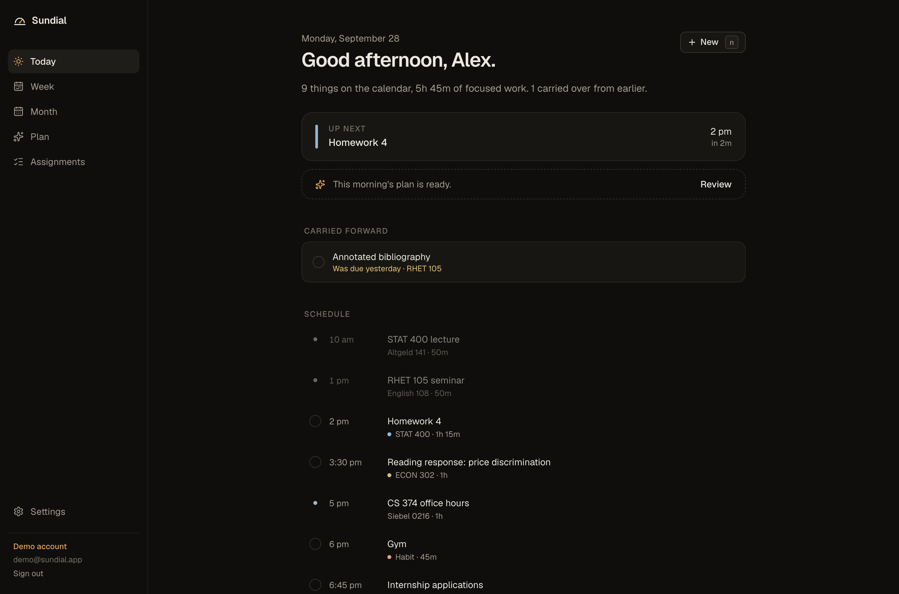
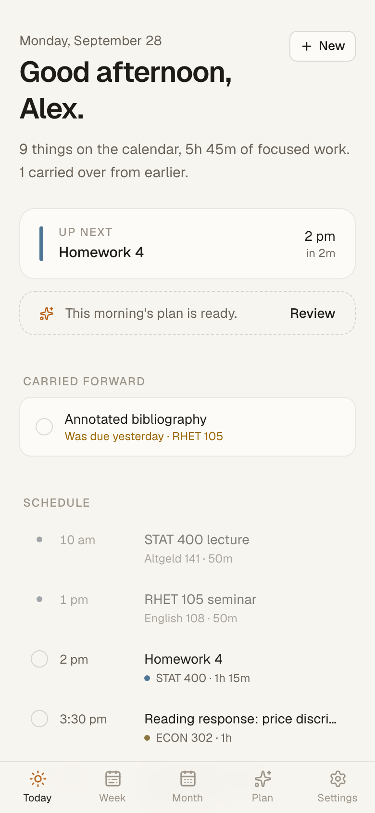
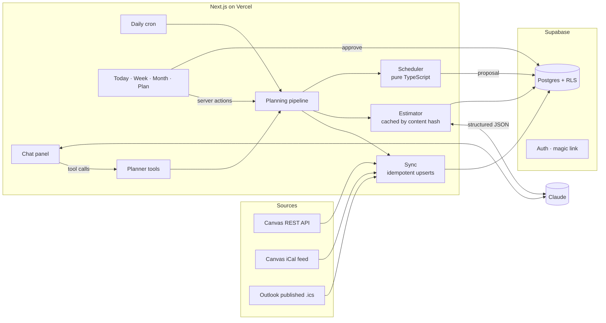

# Sundial

**A calm planner that reads my coursework, estimates it, and finds the time — around the gym, not instead of it.**

<!-- DEMO_LINK -->**Live demo:** _deploying — link coming soon_ · no sign-up, one click into a seeded account



## The problem

Every weekend I used to plan by hand: open Canvas and Outlook, guess how long each assignment
would take, pick a start date that left room for everything else, and copy it all into a planner.
It took an hour, and the plan was stale by Tuesday.

Sundial does that thinking for me, every morning:

1. **Sync** assignments from Canvas and meetings from Outlook for the next 21 days.
2. **Estimate** each new or changed assignment with Claude: hours plus a one-line reason.
3. **Schedule** with plain, deterministic code: meetings are fixed, then the gym, then internship
   applications, then assignment work back-scheduled from each deadline into free time.
4. **Propose** the plan as a diff against my calendar. Nothing changes until I approve it.

If the week doesn't fit, it says so — *"Homework 3 needs 2h 30m more than fits before Thu 11:59 pm.
Raising your 6h/day work limit would make room."* — instead of quietly dropping something.

| Week | Plan review |
|---|---|
|  |  |

| Chat |
|---|
|  |

| Month (dark) | Today (dark) | Mobile |
|---|---|---|
|  |  |  |

## Why the LLM estimates but code schedules

The two halves of planning have opposite shapes.

**Estimating is fuzzy.** "Five proof-heavy DP problems in an upper-level algorithms course" → about
7 hours. That judgment comes from reading prose, which is what language models are good at. The
model returns structured JSON (validated with Zod), and each estimate is cached by a hash of the
assignment's content, so an unchanged assignment is never sent twice. My own estimate always wins.

**Scheduling is a constraint problem.** It needs guarantees an LLM can't give:

- **Correctness:** no overlaps, no work outside my day, the gym is never displaced, daily limits hold.
  These are checked by unit tests, including invariants like "every minute of work is either placed
  or reported as a conflict."
- **Determinism:** the same inputs always produce the same plan, so re-planning doesn't reshuffle my
  week for no reason, and a bug is reproducible.
- **Explainability:** every block carries a reason generated from the actual rule that placed it
  ("Session 2 of 3 · due Thu 11:59 pm; on track to finish by Wed").
- **Cost and speed:** scheduling runs in milliseconds, for free, on every edit.

So the model only ever changes *inputs* (an estimate, a preference, a no-work window, a remembered
fact). The scheduler places blocks. In chat, every change is a visible, undoable tool call — even
"no work Friday nights" becomes a scheduler setting rather than a promise the model has to keep.

## How the scheduler works

Time is modelled as 15-minute slots per day in my timezone (DST-safe).

1. **Fixed first.** Busy events, locked blocks (anything I've edited by hand), and finished work are
   marked unavailable, as is the past.
2. **Habits by priority.** Each habit goes at the start of its window at its target length. If the
   window is tight, it shrinks to its minimum. If the window is full, it moves as close to the window
   as possible (with a warning). If the day is truly full, that's an error — never a silent drop.
3. **Assignments, back-scheduled.** Latest deadline first, each fills the days closest to
   *(due − 24h buffer)* and walks back toward today. Within a day it takes the earliest free slot, in
   sessions of 30–120 minutes with a short break between them, respecting a daily cap (6h) and a
   per-assignment daily cap. Latest-deadline-first with as-late-as-possible placement is the mirror
   image of earliest-deadline-first, so if a feasible schedule exists for splittable work, it finds it.
4. **Fallbacks.** Anything left may use the buffer window (warning). Overdue work goes in the first
   free time, after on-time work is protected. Whatever still doesn't fit becomes a conflict with the
   exact shortfall and the reason (calendar full vs. daily limit).

Source: [`src/lib/scheduler/schedule.ts`](src/lib/scheduler/schedule.ts) · tests:
[`schedule.test.ts`](src/lib/scheduler/schedule.test.ts)

## Architecture



**Stack:** Next.js 16 (App Router, server actions) · TypeScript · Tailwind v4 · Supabase (Postgres,
auth, row-level security) · Anthropic API · Vercel (hosting and cron) · Vitest · Playwright for
screenshots.

**Data model highlights**

- Every table is user-owned and protected by RLS (`user_id = auth.uid()`), with composite foreign
  keys so rows can't reference another user's data. pgTAP tests in
  [`supabase/tests`](supabase/tests) check this.
- Canvas tokens and feed URLs are AES-256-GCM encrypted in a table with RLS on and **no** policies,
  so only server code can read them. The browser never receives a secret.
- Syncs upsert on natural keys — `(user, source, external_id)` for assignments and
  `(user, source, uid, instance_start)` for each occurrence of a recurring event — so re-syncing never
  duplicates. Items that disappear upstream are soft-removed and restored if they come back.
- Plans are stored as proposals. Approval is one Postgres function (`approve_plan`) that swaps the
  committed schedule atomically.

## Features

- **Today** — greeting, what's next, overdue work carried forward, check-off that hides items.
- **Week** — time-blocked calendar; click a block to change its time (which locks it).
- **Month** — deadlines and planned hours per day.
- **Plan** — stats, conflicts, editable estimates, and a diff of what changes. Approve or discard.
- **Settings** — preferences, habits (add, edit, retire), sources, courses.
- **Chat** (`/`) — "plan my day", "I'm sick Tuesday, reshuffle", "no work Friday nights". Claude
  works through tools (read schedule, find free time, move a block, mark unavailable, update
  preferences or habits, set an estimate, remember a fact, re-run the scheduler). Every call shows up
  as a card; changes apply instantly with **Undo**, and re-planning still produces a proposal to approve.
- **Memory** — durable facts from chat ("stats psets take me longer") feed every estimate and chat
  reply; view and delete them in Settings. Saving one refreshes cached AI estimates.
- **Calibration** — finishing an assignment records estimated vs. actual time (from completed
  sessions, editable). Each course gets a correction factor, shrunk toward 1× until there's enough
  history, applied to future AI estimates: *"+20% for this course · calibrated from 2 completed items."*
- **Keyboard** — `t` today · `w` week · `m` month · `p` plan · `a` assignments · `n` new · `,` settings.
- Light and true-dark themes (follows the system), fully usable on a phone.

## Run it locally

Requires Node 22+ and Docker.

```bash
git clone https://github.com/anirudhaugile/sundial && cd sundial
npm install
npx supabase start               # local Postgres, auth and Mailpit
npx supabase db reset            # applies migrations
cp .env.example .env.local       # fill in keys from `npx supabase status`
openssl rand -base64 32          # → SECRETS_ENCRYPTION_KEY
npm run dev
npm run seed:demo                # optional: the demo account, then open /demo
```

Magic-link emails land in Mailpit at http://127.0.0.1:54324. Without `ANTHROPIC_API_KEY` the app
still works, using rough default estimates (and no chat).

**Tests**

```bash
npm test          # scheduler, iCal parser, estimator; sync + cache integration tests when local Supabase is up
npm run test:db   # RLS tests (pgTAP)
```

## Deploy

1. Create a Supabase project, run `npx supabase link` and `npx supabase db push`.
2. In Supabase → Authentication → URL configuration, set the Site URL to your domain and add
   `https://<domain>/auth/callback` as a redirect URL.
3. Import the repo in Vercel and set the variables from `.env.example` (`CRON_SECRET` protects the
   daily cron in `vercel.json`).
4. Visit `/demo` once to create the demo account.

## Project layout

```
src/app/(app)/        Today, Week, Month, Plan, Assignments, Settings (+ server actions)
src/app/api/cron/     daily sync + plan, demo reset
src/lib/scheduler/    the deterministic scheduler and its tests
src/lib/sources/      Canvas client, iCal parser, idempotent sync
src/lib/llm/          Claude client and estimator
src/lib/planner/      estimate resolution, proposal creation, the pipeline
supabase/             migrations and RLS tests
```
